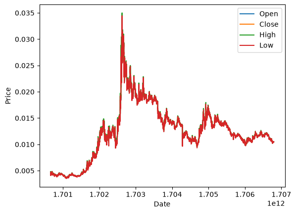
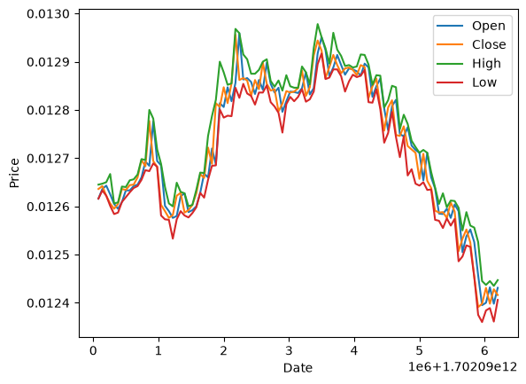
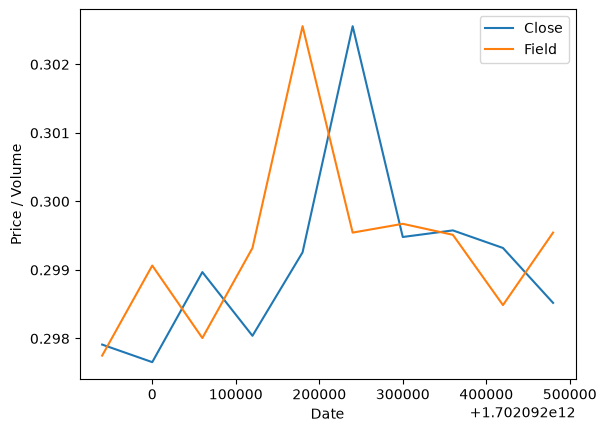
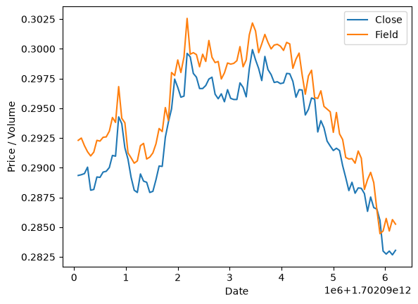
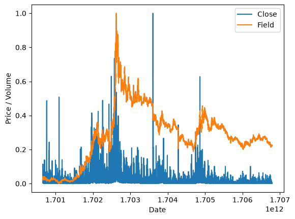
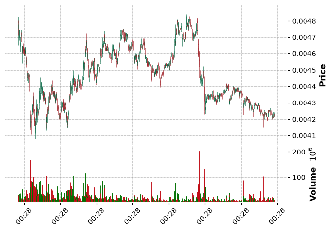
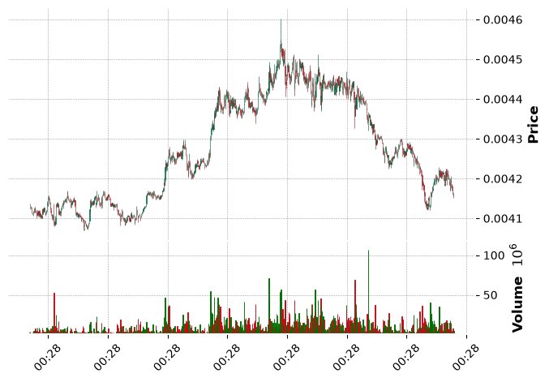
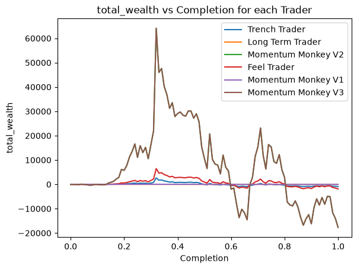
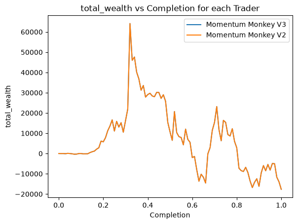
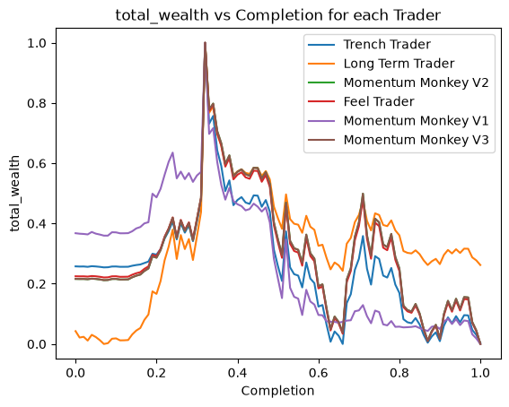

# Monkey's Momentum in Crypto

> ## Quant Modelling Capstone Project

## Submission Details

- **Team Name**: Aditya Prasad Dash
- **Team Members**:
  - Aditya Prasad Dash - 23BCS10138

## Project Overview

This project dives into the analysis of a trading strategy known as "Momentum Monkey" in the cryptocurrency market.

To understand what's happening in this project well, it is better that things get broken down into parts. This project is divided into three parts.

**[Part I]** **Preliminary Analysis**: The first part involves analyzing the dataset being used, basic visualizations, market visualizations, some thoughts on best possible move based on visually available data.

**[Part II]** **Simulation**: The second part involves creating a simulator that simulates trading with some basic rules, building various strategies, and iterating on the strategies to optimize.

**[Part III]** **Strategy Analysis**: The third part involves analyzing the strategy that was optimized, why it out-performs, and more analysis that can be observed based on Preliminary Analysis and Simulation.

## Disclaimer

This project report majorly focuses on experimenting with a strategy and analyzing the results. The project (as of writing the report) only contains information based on a single dataset, and it is recommended to check the GitHub repository for any new updates.

The original problem statements that were provided has been combined and divided again in order to make the project more structured and easier to understand.

The folders contain only relevant files, and some files have been ignored in the report. The notebook is primarily used only for basic analysis and visualizations. Any conclusions, plots and references are suggested to be made from the report README file, notebook is only used as a sandbox for testing and visualizations. The code files contain the code for the simulator, strategy, and other relevant code.

Although mentioned that notebook is sandbox and playground, it is recommended to check the notebook for any visualizations and analysis that may not be present in the report.

# **`[PART I]`** Preliminary Analysis

## Data Overview

The dataset used was obtained from a Kaggle dataset collection. The file was `1000BONKUSDT.csv` from [Cryptocurrency futures OHLCV dataset (1m)](https://www.kaggle.com/datasets/arthurneuron/cryptocurrency-futures-ohlcv-dataset-1m-2024).

The dataset collection is over 3GB in size, however for the current project, only the `1000BONKUSDT.csv` file was used, which is around 6MB in size.

The dataset contains the following columns:

- `d`: Timestamp of the data point
- `o`: Open price
- `h`: High price
- `l`: Low price
- `c`: Close price
- `v`: Volume of the asset traded in that minute

There are 102184 rows in the dataset, and all of them are clean and usable. There is no missing data, no duplicates, and the data cleaning and processing steps are not required for this dataset.

## Initial Analysis on Data

On initial analysis, the data was found to be clean and usable. The data seemed mostly consistent, and there were no missing values or duplicates. The data was also found to be in a good format for analysis.

On additional analysis, some validations were done to check for inconsistencies in the data. Although there wasn't any anomalies found. These were done by checking the open and close prices with high and low prices, while making sure high remains the highest and low remains the lowest.

On additional swaps and experimental comparisons, an interesting observation was made. This includes the **open price** and **close price**. The objective was to find _how many open prices are greater than close prices_.

Following is the result for `Closing Price > Opening Price Ratio`

```py
49.156424% (50230 out of 102184)
```

From this, it can roughly be assumed that the market is slightly bearish, but overall if someone trades for a long time in market, they would likely get back to their original position, assuming the market remains consistent.

There was also another interesting insight on **High** and **Open** prices.

Following is the result for `High Price > Opening Price Ratio`

```py
92.320716% (94337 out of 102184)
```

Note, that since High price is the highest price it went during a market session, this implies that the remaining percentage of falsy values represents the number of times the market opened at the highest price, and then wasn't able to beat it.

Another insight can be drawn from the **Low** and **High** prices.

Following is the result for `Low Price < High Price Ratio`

```py
5.731817% (5857 out of 102184)
```

Oddly, the number of times market session ended at the highest price is relatively lower.

Whilst this being a very normal and expected observation, it can be assumed that the market is slightly bearish, and the market is not able to sustain the high prices for long.

## Visualising the Data

While the initial analysis did add to expectations, the visualizations add a lot more to the understanding of the market.

With help of `Matplotlib` and `mplfinance`, candlestick charts and line charts were plotted to visualize the market data.

Starting with the simple line chart of all the fields in one chart, the following was observed.

<div align="center">



[Figure 1: Line Chart of All Fields](./images/global_line_chart.png)

</div>

This chart is one of the most basic yet most help visualizations to make remarks on the market.

The chart shows that the market had a spike initially in the early (roughly) 40%, and then it started to decline and then it started to stabilize to a low price which is not too far from the initial price.

This gives and immediate idea that market was highly profitable for a short period of time, and then any trades are more riskier and lean towards a bearish market.

Post this, visualizations of parts of the chart were made to understand the market better in a shorter term. Multiple visualizations of varying time periods were made.

<div align="center">



[Figure 2: Zoomed In View of a Random Section](./images/zoomed_line_chart.png)

</div>

This chart shows a zoomed in view of a random section of the market. The chart shows that the market has frequent fluctuations, and for this specific section, the market is bearish.

> Note, that this is a zoomed view, and this is not an eligible base to conclude the market is bearish, refer to the notebook to find other zoomed in views.

On further analysis, attempts were made to observe how various fields of the dataset relate to each other.

<div align="center">



[Figure 3: Open vs Close Price](./images/open_close_relativity_chart.png)

</div>

The chart doesn't really add much to analysis, however it helps in validation of the data. The close field is identical to the open field, just shifted by a small amount. This is expected, and the chart shows that the data is consistent.

<div align="center">



[Figure 4: High vs Close Price](./images/high_close_relativity_chart.png)

</div>

This chart as well doesn't contribute much to analysis, however it helps in validation of the data. The high field is is always greater than or near the close field, which is expected. Apart from that, the lines are neither too similar nor too different, which is expected. This further validates that the data is consistent and usable.

<div align="center">



[Figure 5: Volume vs Close Price](./images/volume_close_relativity_chart.png)

</div>

This chart is a normalized chart of volume and close price, to analyze how the volume of trades relates to the close price. An interesting observation can be made from this chart. The volume line is outlining, or atleast following the close price line. This implies that there is some correlation between the volume of trades and the close price.

## Market Visualization of Data

Although candle-stick charts are a common visualization for market data, here they didn't really add a lot to the analysis and expectation set-up. However, they do help in understanding the market better, and they do help in visualizing the market data better.

Additionally, due to the large size of the dataset, the candle charts are not very useful for analysis, and from only a few zoomed in views, it is not ideal to conclude the market is bearish or bullish.

<div align="center">



[Figure 6: Candlestick Chart of Full Dataset](./images/global_candle_chart.png)

</div>

Although the chart is not very useful for analysis, it does help in understanding the market better. The chart shows that the market constantly fluctuates and overall, the market is bearish.

> Given the size of the dataset, it is not ideal to conclude the market is bearish or bullish, libraries do have issues in plotting large datasets, and claiming anything is risky.

<div align="center">



[Figure 7: Candlestick Chart of Random Section](./images/zoomed_candle_chart.png)

</div>

This chart is a zoomed in view of a random section of the market. The chart shows that the market has frequent fluctuations, and for this specific section, the market is slightly bullish and has a mountain-like shape.

## Expectations from Preliminary Analysis

The preliminary analysis was helpful in understanding the market, and it helped in setting up expectations for the simulation.

The market is slightly bearish, and the market has frequent fluctuations.

The ideal time to trade is the initial periods, and past a point in time, the market is not very profitable and is risky.

# **`[PART II]`** Simulation

## Simulation Overview

While the preliminary analysis was helpful in understanding the market, it is just theoretical and doesn't really help in concluding a lot apart from the market being slightly bearish.

To deeply understand the market, a simulation of this market, as a replay of all the trades that happened in the market, would help in verifying a lot of analysis and expectations.

This project contains a simulator that simulates the market, and allows for various strategies to be tested and optimized.

> This report doesn't contain the code for the simulator, refer to the GitHub repository for the code. Additionally, the docs are maintained in the GitHub repository, and the report mainly focuses on the analysis and results of the simulation.

To add a little more context, the simulator will just replay all the market sessions based on the dataset, it will contain trader agents that will perform trades based on the strategy they have been assigned.

> The simulator is quite flexible, and it allows for various strategies to be tested and optimized. The simulator can also use a different dataset, and is easy to setup the codebase for a different dataset.

## Trading Logic

The simulator contains of 2 main components, the market simulator and the trader agents. The market simulator will replay the market sessions based on the dataset, and the trader agents will perform trades based on the strategy they have been assigned.

For each session, the market simulator will provide the trader agents with the market data for that session, and the trader agents will perform trades based on the strategy they have been assigned.

Traders need to only return the bidding price and quantity. The simulator will handle the what happens.

## Trade Execution Logic

Trades are executed based on the following logic:

1. `Quantity is 0`: No trade is made, and the trader agent is not interested in trading in this session.
2. `Quantity is not 0 but Bid price is not between Low and High of the current session`: The trade is not made, although the trader agent is interested in trading in this session, the bid price was not met, and the trade is not made.
3. `Quantity is more than 0 and Bid price is between Low and High of the current session`: The trade is made, and the trader agent is interested in trading in this session, and the bid price was met, and the trade is made, stocks are purchased.
4. `Quantity is less than 0 and Bid price is between Low and High of the current session`: The trade is made, and the trader agent is interested in trading in this session, and the bid price was met, and the trade is made, stocks are sold.

## Simulation Assumptions

The traders are assumed to have infinite money, and they can trade as much as they want. The traders are however not assumed to have infinite stocks, and they can only sell the stocks they have.

## Indicators

For the purpose of evaluating the strategies, each trader agent is also given a wallet. Although the wallet belongs to the trader agent, it is handled by the simulator.

Additionally, for evaluation purposes, the simulator has checkpoints to check on how the trader agents are performing. The checkpoints are set at some dynamic points of the market sessions. In these checkpoints, the simulator will output a snapshot of the trader agents performance, how many trades were made, and the current details of the wallet.

On the topics of wallet, the wallet contains the following details:

- `Cash`: The amount of cash the trader agent has.
- `Assets`: The amount of assets the trader agent has.
- `Credit Count`: The number of times the trader agent has sold assets.
- `Debit Count`: The number of times the trader agent has bought assets.

At every snapshot, cash details, assets details, total value, credit count, debit count, total transaction count.

The total value is calculated as `Cash + (Assets * Current Price)`, where current price is the close price of the current session.

These indicators are choosen since in a real world scenario, these are the most basic indicators a trader would have. The only exception is the initial cash where the trader only has limited cash, but assuming the trader bots will work for big institutions, it is safe to assume that they can use as much cash as they want, and the only limiting factor is the number of assets they can buy or sell.

Total wealth, that is total value, is the main indicator that will be used to evaluate the performance of the strategies, and the other indicators are just for reference.

## Strategies and Signals

The strategies in the report were evolution based. The strategies were evolved based on the performance of the trader agents in the checkpoints.

Small changes were made to the strategies based on the performance of the trader agents in the checkpoints, and the strategies were evolved based on the performance of the trader agents in the checkpoints.

Only a few strategies were kept, which performed decent or had potential to perform well.

> The discarded strategies are not present in the codebase, however could be added in the future for reference. Only the good strategies or evolved strategies are present in the codebase.

### Long Term Trader

This strategy is a long term strategy, which is based on the idea of "long term trading".

The trader buys on the first session, and then keeps it for as long as possible.

This will help in accessing the long term trend of the market, and it will help in understanding how the market performs in the long term.

This can be considered as the baseline strategy, and it can be expected that this strategy should be beaten by other strategies, since it is a very basic strategy, and it doesn't really do any analysis or optimization.

### Feel Trader

This strategy is a very basic strategy, which is based on the idea of "feeling", and it's not the feeling of the market, but the feeling of the trader agent itself.

The trader will randomly decide a bid price as it feels like (-5% to +5% of the current price), and it will always prefer a fixed quantity of assets.

There is not a lot of expectation from this strategy, however it is also a good baseline strategy to compare other strategies with.

This strategy also relies on keeping stocks for as long as possible.

### Trench Trader

This strategy is a better version of the feel trader, it only buys when the price is low. The depth / tolerance is dynamic and can be adjusted. (default is -5% of the current price).

This strategy is also relying on keeping stocks for as long as possible.

### Momentum Monkey V1

This strategy is based on the idea of "momentum trading", which is a very common trading strategy in the market.

On evolving the trench trader, this strategy primarily works on the idea that if a streak of bullish sessions is observed, then the market is in a bullish momentum, and the trader buys.

And unlike previous strategies, this strategy also sells when it finds a consecutive streak of bearish sessions, which implies a bearish momentum.

The momentum is dynamic and can be adjusted, the default is 5 consecutive sessions.

### Momentum Monkey V2

This strategy is an evolved version of the Momentum Monkey V1, it is based on the same idea of "momentum trading".

The only difference is that this strategy does not rely on the streak but rather how many bullish or bearish sessions are observed in it memory capacity.

There is also another factor of momentum which decides how many of the sessions in the memory should be bullish or bearish to trigger a buy or sell.

Capacity and momentum are dynamic and can be adjusted, the default capacity is 10 sessions, and the default momentum is 5.

### Momentum Monkey V3

This strategy is an evolved version of the Momentum Monkey V2, it is based on the same idea of "momentum trading".

However, this strategy is more dynamic. Instead of having a fixed momentum for both buy and sell, this strategy has a dynamic momentum for buy and a separate dynamic momentum for sell.

The strategy also has a dynamic memory capacity, which decides how many sessions to look back to decide the buy or sell.

The default buy momentum is 5, the default sell momentum is 5, and the default memory capacity is 10.

This is the most evolved strategy, however due to more dynamics, it has bunch of parameters to optimize, and for this dataset, a bunch of clones were made with varying parameters to find the best performing one.

# **`[PART III]`** Strategy Analysis

## Strategy Analysis Sources

The simulator output can be passed to a log file, and the log file can be used to analyze the performance of the strategies. This log file contains the wallet details of the trader agents at each checkpoint, and it can be a source of analysis for the strategies.

However, the log file is very bulky, hence it is not easy to analyze. Instead, the simulator was modified to output a CSV file, which contains the details of the trader agents wallet at each checkpoint, and this CSV file can be used to analyze the performance of the strategies.

The `snapshots.csv` being used for analysis was done with 100 checkpoints, which means that the performance of the trader agents was recorded at 100 different points in time during the market sessions. This allows for a more detailed analysis of the performance of the strategies over time.

> The log file will still be available in case detailed analysis is required, however the report will focus on the final results of the strategies.

## Strategy Analysis Results

From the top, here are some figures:

### Maximum Total Wealth

- **Value**: 86785.9226
- **Agents**:
  - `[Alternate] Momentum Monkey V3 1`
    - Checkpoint: 0.32
  - `Momentum Monkey V2`
    - Checkpoint: 0.32
  - `Momentum Monkey V3`
    - Checkpoint: 0.32

### Minimum Total Wealth

- **Value**: -17667.3935
- **Agents**:
  - `[Alternate] Momentum Monkey V3 1`
    - Checkpoint: 1.0
  - `Momentum Monkey V2`
    - Checkpoint: 1.0
  - `Momentum Monkey V3`
    - Checkpoint: 1.0

### Maximum Assets Count

- **Value**: 9118700
- **Agents**:
  - `[Alternate] Momentum Monkey V3 1`
    - Checkpoint: 1.0
  - `Momentum Monkey V2`
    - Checkpoint: 1.0
  - `Momentum Monkey V3`
    - Checkpoint: 1.0

### Maximum Assets Cashed

- **Value**: 105642.849
- **Agents**:
  - `[Alternate] Momentum Monkey V3 1`
    - Checkpoint: 0.97
  - `Momentum Monkey V2`
    - Checkpoint: 0.97
  - `Momentum Monkey V3`
    - Checkpoint: 0.97

### Maximum Cash

- **Value**: 23.9276
- **Agents**:
  - `[Alternate] Momentum Monkey V2 2`
    - Checkpoint: 0.38
  - `[Alternate] Momentum Monkey V3 3`
    - Checkpoint: 0.38
  - `[Alternate] Momentum Monkey V3 4`
    - Checkpoint: 0.38
  - `[Alternate] Momentum Monkey V3 5`
    - Checkpoint: 0.38

### Top 5 Long Term Strategy Performers

- **Agents**:
  - `Long Term Trader`
    - **Total Wealth**: 0.57360
  - `[Alternate] Momentum Monkey V1 5`
    - **Total Wealth**: 0.00000
  - `[Alternate] Momentum Monkey V1 4`
    - **Total Wealth**: 0.00000
  - `[Alternate] Trench Trader 5`
    - **Total Wealth**: -0.58498
  - `[Alternate] Momentum Monkey V1 3`
    - **Total Wealth**: -0.93280

## Strategy Visualizations

While the non-visualized anayalsis helped in understanding the performance of the strategies, visualizations help in understanding the performance of the strategies better.

Following are some visualizations of the performance of the strategies over time, based on the snapshots taken at the checkpoints.

<div align="center">



[Figure 8: Total Wealth vs Completion for each Trader](./images/traders_total_wealth_chart.png)

</div>

The chart shows all the optimized strategies of each evolution. On analysis, it can be observed that the Momentum Monkey V3 was able to reach the peak total wealth and it significantly dominating the other strategies, however by the end of the replay, it was also significantly in the negative, which implies that the strategy was not able to sustain the high wealth it reached.

The chart also describes about Feel Trader, which the next best visible strategy, and although it also performed worse in the later stages of the market, it is surprising that it was able to outperform some of the evolved strategies.

While the chart does show the performance of other strategies, those are flat-lined, which doesn't add much to the analysis. And some strategies are not visible in the chart, which implies that there is a possibility of overlapping of the lines, which is not ideal for analysis.

<div align="center">



[Figure 9: Total Wealth Comparison between Momentum Monkey V2 and Momentum Monkey V3](./images/monkey_v2_v3_chart.png)

</div>

The chart shows the comparison between Momentum Monkey V2 and Momentum Monkey V3, and interestingly, one of the line is missing, which implies that there is an overlap between the lines. This implies that the performance of Momentum Monkey V2 and Momentum Monkey V3 is very similar, and it is hard to say which one is better based on this chart.

Although this also gives an insight that the Monkey V2 is also one of the best performing strategies. This can also be observed in the non-visualized analysis, where the Monkey V2 also reached the peak total wealth.

On doing further analysis, it was found that the Monkey V3 and Monkey V2 have identical performance, which is surprising given that Monkey V3 is an evolved version of Monkey V2, and it has more dynamics than Monkey V2. This implies that the additional dynamics in Monkey V3 did not really add much to the performance of the strategy, and it is possible that the additional dynamics made the strategy more complex and harder to optimize.

<div align="center">



[Figure 10: Normalized Total Wealth Comparison for all Traders](./images/traders_total_wealth_normalized_chart.png)

</div>

The chart shows the normalized total wealth comparison for all traders, and it gives a better visualization of the performance of the strategies over time.

The chart also gives a better clarity on what the evolution of the strategies actually did to the performance of the strategies.

From analysis, it seems that the evolution only helped in maximizing the amplitude of the performance, and it did not really help in sustaining the performance.

All of the strategies have the peak at almost the same time. The graph also shows similarity to the market chart, which implies that the strategies are not really able to outperform the market, and they are just following the market.

An interesting observation is that while most of the strategies ended lower than they started, the Long Term Trader strategy ended higher than it started, which implies that the Long Term Trader strategy was able to sustain the performance better than the other strategies.

## Key Observations

While the analysis and visualizations helped in understanding the performance of the strategies, it also helped in understanding the market better.

A lot of expectations from the preliminary analysis were met, and some of the results were surprising and were not anticipated.

Overall, the market was slightly bearish, and most of the strategies went to loss near the end of the data replay. The only strategy that sustained from start was the one which didn't really trade a lot.

A lot of trades that were made after a point of time were loss making, and while it was clearly visible in the preliminary analysis, it was not anticipated that the strategies would be able to make a lot of trades after that point of time.

Talking about the strategies, the earlier evolutions were more focused on maximizing trade counts and later one were more optimized to maximize only when there is a scope of profit, or to reduce the loss making trades. However, the loss making trades were still made, and the strategies were not able to sustain the performance.

Interestingly, the Monkey V2 and Monkey V3 had identical performance, which implies that the additional dynamics in Monkey V3 did not really add much to the performance of the strategy, and it is possible that the additional dynamics made the strategy more complex and harder to optimize.

An interesting observation is that the normalized total wealth comparison chart shows very similar performance for most of the strategies. The charts were also similar to the market chart, which implies that the strategies are not really able to outperform the market, and they are just following the market.

# Conclusion

This study was a good learning experience, and it helped in understanding a market better. The preliminary analysis helped in setting up expectations, and the simulation helped in verifying those expectations. The analysis of the strategies and their performance helped in gaining insights into the market and the strategies.

While the strategies were not able to outperform the market, it could still be possible that with more optimization and a separate dataset, the strategies could be improved to outperform the market.

The project was also a great source to experiment with the Momentum Monkey strategy. The strategies were evolved to Momentum Monkey with small changes, and the performance of the strategies was analyzed. It started with a basic strategy, and then evolved to a more complex and dynamic strategy, and the performance of the strategies was analyzed.

Unfortunately, the strategies were not good enough, but for a specific time period of the data, the strategies were good, for example around 0.32 checkpoints, where the strategies were able to reach the peak total wealth.

## Limitations in the Project

While the simulator tried to mimic a real world market, there are some limitations in the project that should be noted.

These limitations include:
- strategies were allowed to use infinite money without any restrictions
- strategies were more focussed on total wealth and not on all indicators
- all strategies had a fixed quantity request
- the simulator was allowing all traders to trade as long as the bid price was met
- the simulator was not taking volume into account
- the simulator was able to simulate only a single dataset
- tests were done on a single dataset, and the strategies were not tested on other datasets

## Future Work

The project can be improved in the future by addressing the limitations mentioned above. The strategies can be improved to take into account all indicators, and the simulator can be improved to take into account volume and other factors.

Additionally, the strategies can be tested on other datasets to see if they can outperform the market in different scenarios.

For the momentum monkey strategy, the strategies can be improved and optimized further. Additionally, early stopping and variable selling and buying quantities might improve the performance of the strategies.

